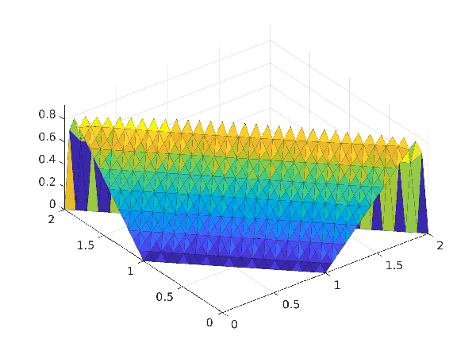

# FEM-BBoption
Codes for the final project of the course Mathamatical models in Finance

In this project the evaluation of a two-asset basket double barrier option is carried out with FEM solution of the Black-Scholes model. 
Detailed explainations can be found in [the report](./FEM_2barrier_options_report.pdf). 